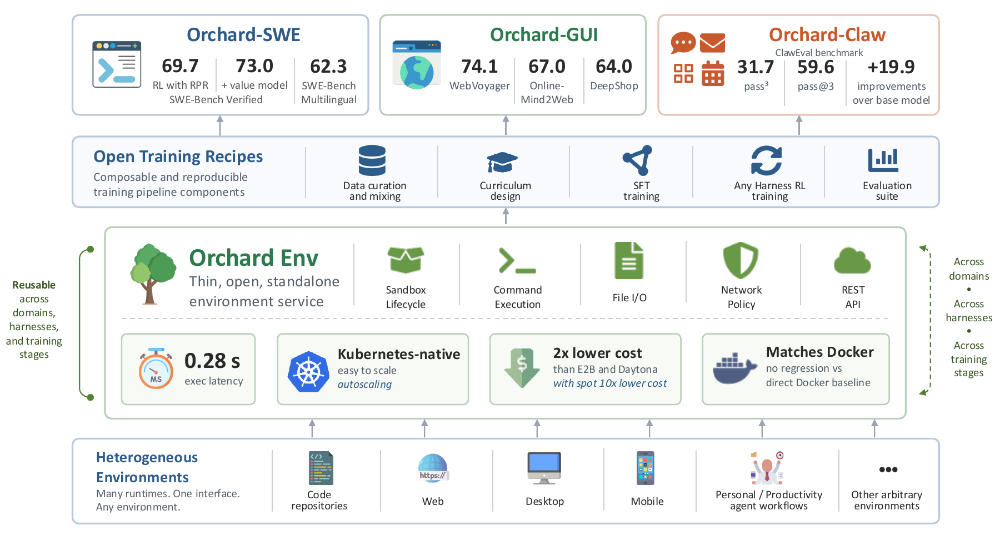
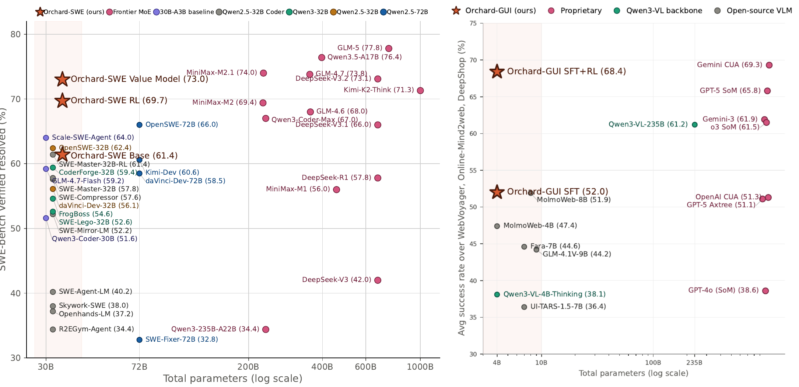

# Orchard

<p align="center">
  <a href="https://arxiv.org/abs/2605.15040"></a>
  <a href="https://huggingface.co/datasets/microsoft/Orchard"></a>
  <a href="LICENSE"></a>
</p>

**Orchard is an open foundation for agentic modeling research.** We build one
shared substrate — **Orchard Env** — and then use it to explore agentic modeling
*recipes* across domains: software engineering, browser navigation, computer
use, and personal-assistant workflows.

The foundation exists to make the recipes possible. Because the environment
layer is a stable service rather than a piece of a training stack, every recipe
reuses the same substrate for trajectory distillation, on-policy RL rollouts,
and evaluation — so datasets, training recipes, and evaluation protocols stay
portable across harnesses, domains, and projects instead of being rebuilt for
each new study.

<p align="center">
  
</p>

| Layer | What it is |
| --- | --- |
| **Recipes** | The research. Open SFT + RL recipes explored on top of the foundation — Orchard-SWE, Orchard-GUI, and Orchard-Claw — plus follow-on work such as OpenWebRL and OpenForge RL (see [News](#news)). |
| **Orchard Env** ([`orchard_env/`](orchard_env/)) | The foundation. A Kubernetes-native sandbox service + Python SDK that spins up thousands of isolated containers on demand and drives multi-turn agent ↔ sandbox interaction (exec, file I/O, git patches) over HTTP. |
| **Trainer** ([`trainer/slime/`](trainer/slime/)) | RL training stack — a vendored [slime](https://github.com/THUDM/slime) fork with Orchard rollout code under [`examples/orchard/`](trainer/slime/examples/orchard/); fork-local changes tracked in [`ORCHARD_CHANGES.md`](trainer/slime/ORCHARD_CHANGES.md). |

- 📄 **Paper:** [*Orchard: An Open-Source Agentic Modeling Framework*](https://arxiv.org/abs/2605.15040) (Peng et al., arXiv:2605.15040)
- 🤗 **Dataset:** [`microsoft/Orchard`](https://huggingface.co/datasets/microsoft/Orchard) — `swe` (107K SWE trajectories) and `gui` (3,070 multimodal browser-navigation rollouts) subsets

## News

- **[2026-07] 🎉 We are excited to release [OpenForge RL](https://arxiv.org/abs/2607.21557)**,
  which extends Orchard to train agents inside their *real deployment harnesses*
  — ZeroClaw, OpenClaw, Codex — instead of the simplified reimplementations open
  training stacks usually require, removing the train–deploy mismatch. A
  lightweight proxy records the harness's own inference calls and reconstructs
  them into samples for any RL codebase (e.g. veRL), while Orchard Env launches
  each rollout as a remote container, so any harness pairs with any environment.
  This is exactly what Orchard Env is built for: every sandbox ships with popular
  agent harnesses — `codex`, `claude`, `pi`, `opencode`, `hermes` — already on
  `PATH`, so switching the harness you train or evaluate against is a change of
  command, not a change of image. OpenForge-GUI (8B) reaches **37.7** on
  OSWorld-Verified and **72.3** on WebVoyager; OpenForge-Claw (30B-A3B) reaches
  **33.7** on QwenClawBench and **28.1** on MCPAtlas.

- **[2026-06] 🎉 We are excited to release [OpenWebRL](https://arxiv.org/abs/2606.02031)**,
  which extends Orchard-GUI into a full online multi-turn RL study on *live*
  websites — covering supervised initialization, multimodal context management,
  trajectory-level success judging, and multi-turn policy optimization. It builds
  a fault-tolerant live-browser environment on Orchard Env with navigation
  retries, timeout handling, and structured failure attribution, so unstable
  website behavior stays separable from model behavior at training scale.
  OpenWebRL-4B reaches **67.0%** on Online-Mind2Web and **64.0%** on DeepShop
  from only 0.4K initialization trajectories and 2.2K open-ended RL tasks — a new
  open-source state of the art on live-web benchmarks, competitive with OpenAI
  CUA and Gemini CUA.

- **[2026-05] 📄 The [Orchard paper](https://arxiv.org/abs/2605.15040) is on arXiv**,
  together with the [`microsoft/Orchard`](https://huggingface.co/datasets/microsoft/Orchard)
  trajectory datasets and Orchard Env.

## Recipes

Three studies from the Orchard paper — different domains, harnesses, and reward
mechanisms, one environment service underneath.

| Recipe | Backbone | Training data | Key techniques | Headline result |
| --- | --- | --- | --- | --- |
| **Orchard-SWE** | Qwen3.5-35B-A3B | 107K distilled trajectories | Credit-assignment SFT · Balanced Adaptive Rollout · on-policy distillation · rubric-based process reward · value-model reranking | **73.0%** SWE-bench Verified |
| **Orchard-GUI** | Qwen3-VL-4B-Thinking | 0.4k SFT + 2.2k RL tasks | Distillation, then online RL on live websites | **68.4%** avg — 74.1 / 67.0 / 64.0 |
| **Orchard-Claw** | Qwen3-30B-A3B-Thinking | 0.2k synthetic tasks | Opus-synthesized tasks · training across two harnesses | **59.6%** pass@3, **73.9%** under ZeroClaw |

<p align="center">
  
</p>

*Orchard agents versus total parameter count. Both approach or match systems
10–30× larger.*

**The common thread is generalization, not just peak score.** Orchard-SWE keeps
**51.0** on SWE-bench Multilingual (vs 28.7 for OpenSWE-32B) and still works
under a harness never seen in training — **45.0** on SWE-bench Verified and
**20.1** on Terminal-Bench 2.0 with Kimi-CLI, where OpenSWE-32B collapses to 3.6
and 0.0. Orchard-Claw gains the most of any model compared when swapped onto a
stronger harness after training (**+9.3** pass³ / **+14.3** pass@3 under
ZeroClaw). Orchard-GUI beats its own 235B teacher on two orders of magnitude
fewer training tasks. Training against a harness-agnostic environment is what
makes these transfers possible.

## Orchard Env — the foundation

A thin, Kubernetes-native environment service exposing generic primitives —
sandbox lifecycle, command execution, file I/O, network policy, and a REST API —
with no assumptions about the harness, trainer, inference backend, or task
domain sitting above it.

- **REST API** for sandbox lifecycle (create / exec / files / patch / delete)
- **Sync and async Python SDK** with auto-cleanup, retries, and context-manager ergonomics
- **In-pod agent** for low-latency exec over Pod IP (bypasses the K8s API server hot path)
- **Any base image** — the agent is injected by an init container bundling its own
  self-contained Python interpreter, so user images need no Python
- **Any harness** — `codex`, `claude`, `pi`, `opencode`, and `hermes` preinstalled on
  `PATH` in every sandbox, with no install step or network access needed inside it
  ([details](orchard_env/README.md#built-in-agent-harnesses))
- **Multi-replica orchestrator** with Redis-backed state and distributed locks
- **Network isolation** via Calico NetworkPolicy (deny-egress by default), per-sandbox
  CPU / memory / timeout limits, TTL cleanup, and API-key auth

| Metric | Orchard Env | Reference |
| --- | --- | --- |
| Average command-execution latency | **0.28 s** | SkyPilot Code Sandbox 0.284 s · E2B 0.747 s (2.7× slower) · Modal 2.046 s (7.3× slower) |
| 1,000 sandboxes launched in parallel | **100% success**, 26 s end-to-end, ~154 commands/s (11.75 s average create) | — |
| Cost for 128 sandboxes × 240 h (2 vCPU / 8 GiB) | **$3,362** on-demand (**0.47×**) · **$673** on spot (**0.10×**, ~10× cheaper) | Managed sandbox services $7,078–$10,305 |

Swapping Docker for Orchard Env on Terminal-Bench 2.0 causes no regression
(GPT-4.1 34.1 → 35.1, MiniMax-M2.5 52.6 → 54.4, Qwen3-8B-Thinking 7.0 → 8.8),
so the environment is a drop-in substrate for both training and evaluation.

## Quick start

```bash
pip install -e "orchard_env[dev]"

export SANDBOX_BASE_URL="http://your-orchestrator-host"
export SANDBOX_API_KEY="your-api-key"
```

```python
from orchard_env import SandboxClient

with SandboxClient() as client:  # reads SANDBOX_BASE_URL / SANDBOX_API_KEY
    with client.create_sandbox("python:3.11-slim") as sandbox:
        result = sandbox.exec("echo 'Hello, Orchard!'")
        print(result.stdout)
```

**No orchestrator yet?** Four scripts stand one up on Azure AKS — provision,
build and push images, deploy, smoke-test — in about 20 minutes:
[orchard_env/README.md](orchard_env/README.md#deploying-your-own-cluster) for the
short path, [orchard_env/docs/deployment.md](orchard_env/docs/deployment.md) for
every configuration knob, non-Azure clusters, and cost estimates.

**Beyond hello-world** — async client, file I/O, git patches, PTY sessions, and
per-sandbox resource limits: [SDK reference](orchard_env/docs/sdk.md) ·
[REST API](orchard_env/docs/api.md) · [architecture](orchard_env/docs/architecture.md) ·
[project overview](docs/overview.md).

**Exploring a new recipe on Orchard Env?** The REST API
([docs/api.md](orchard_env/docs/api.md)) is the contract and the SDK is a thin
client over it, so a project in any language can depend on the same substrate.
Open a PR to add it to the recipe table above.

## Paper & dataset

The foundation and the three recipes above are described in
[**Orchard: An Open-Source Agentic Modeling Framework**](https://arxiv.org/abs/2605.15040)
(Peng et al., arXiv:2605.15040). OpenWebRL and OpenForge RL are separate papers
that build on the same environment layer — see [News](#news).

- 📄 Paper: [arXiv:2605.15040](https://arxiv.org/abs/2605.15040)
- 🤗 Trajectory datasets: [`microsoft/Orchard`](https://huggingface.co/datasets/microsoft/Orchard) — one repository ships two parallel subsets, both produced inside the same Orchard Env sandbox infrastructure:
  - **`swe` config** — 107,185 multi-turn SWE rollouts over 19,287 unique task
    instances across 2,788 repositories, with verified resolve labels
    (74,649 resolved · 32,536 unresolved) and an average of 47.5 turns per
    trajectory.
  - **`gui` config** — 3,070 judge-verified successful per-step rollouts from a
    web-browsing GUI agent across 409 WebVoyager-style tasks, each with a
    rendered screenshot (multimodal).

## Roadmap

### Stateful sandboxes — pause, resume, and branching

The environment is currently *linear*: a sandbox is created, driven for N turns,
and destroyed. Every rollout re-executes its whole prefix, and a trajectory
yields a single outcome reward that has to be spread across all of its turns —
in our SWE data, an average of **47.5** turns per trajectory. Attributing that
one scalar to the turn that actually mattered is the central credit-assignment
problem, and the paper attacks it indirectly, with retrospective value estimation
over completed trajectories.

Snapshotting makes that measurable directly instead. We are adding:

- **Pause / resume** — checkpoint a sandbox's full state (filesystem, processes,
  environment) at any turn and restore it later, so a rollout can be suspended
  and continued instead of restarted.
- **Branching** — fork *k* independent continuations from the same snapshot at
  turn *t*. Rolling forward repeatedly from a single state gives a Monte-Carlo
  estimate of that state's value, which turns per-turn credit assignment into
  something measured rather than inferred, and makes counterfactuals ("what if
  the agent had not run that command?") directly observable.
- **Prefix sharing** — because a branched prefix is executed once instead of
  once per rollout, tree-structured search and per-turn advantage estimation get
  substantially cheaper than the flat-rollout baseline.

This is the environment primitive that the next round of credit-assignment
research needs, and it belongs in the environment layer rather than in any one
trainer.

## Contributing

Contributions are welcome — please open an issue or pull request. Development
setup, linting, and the test matrix are documented in
[orchard_env/README.md](orchard_env/README.md#development) and
[orchard_env/tests/README.md](orchard_env/tests/README.md).

This project has adopted the
[Microsoft Open Source Code of Conduct](https://opensource.microsoft.com/codeofconduct/);
see [CODE_OF_CONDUCT.md](CODE_OF_CONDUCT.md).

## Security

Please do not report security vulnerabilities through public GitHub issues.
See [SECURITY.md](SECURITY.md) for how to report them.

## Citation

If you use Orchard or Orchard Env in your research, please cite:

```bibtex
@article{peng2026orchard,
  title={Orchard: An Open-Source Agentic Modeling Framework},
  author={Peng, Baolin and Yao, Wenlin and Wu, Qianhui and Cheng, Hao and
          Yu, Xiao and Yang, Rui and Ge, Tao and Sordoni, Alessandro and
          Yuan, Xingdi and Shen, Yelong and He, Pengcheng and Zhang, Tong and
          Yu, Zhou and Gao, Jianfeng},
  journal={arXiv preprint arXiv:2605.15040},
  year={2026},
  url={https://arxiv.org/abs/2605.15040}
}
```

## License

[MIT](LICENSE) © Microsoft Corporation.
