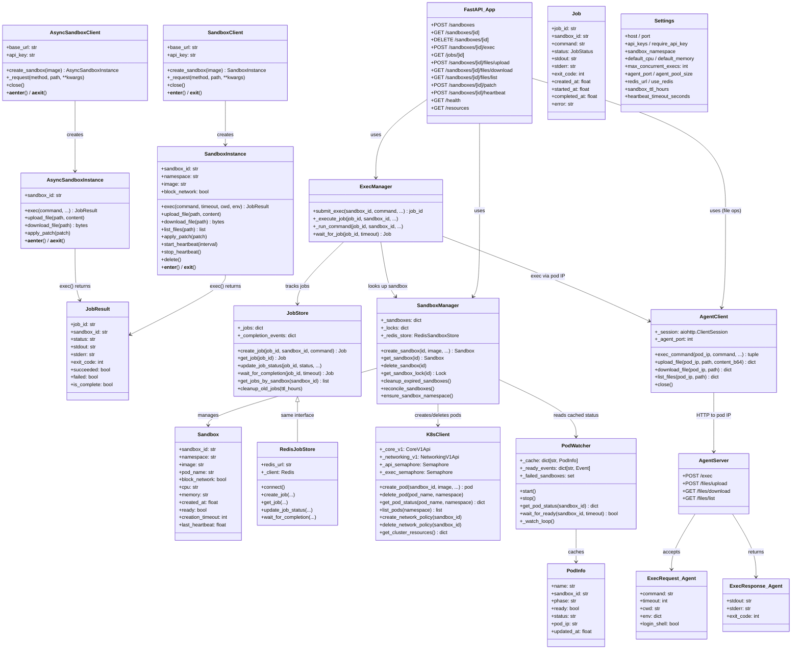
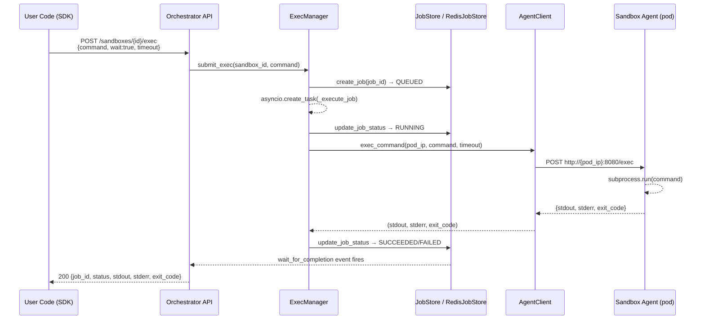
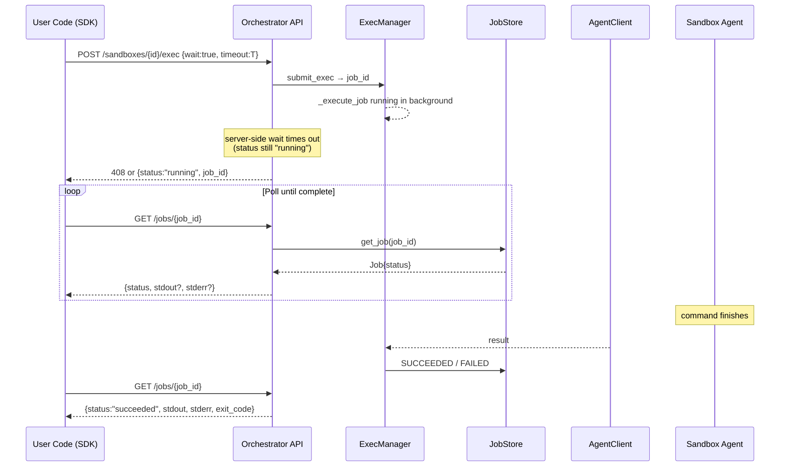
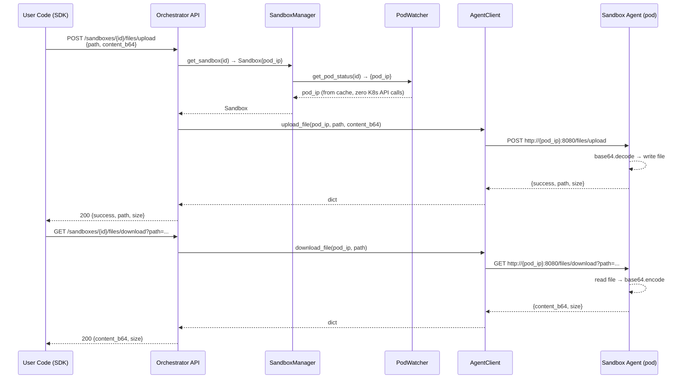
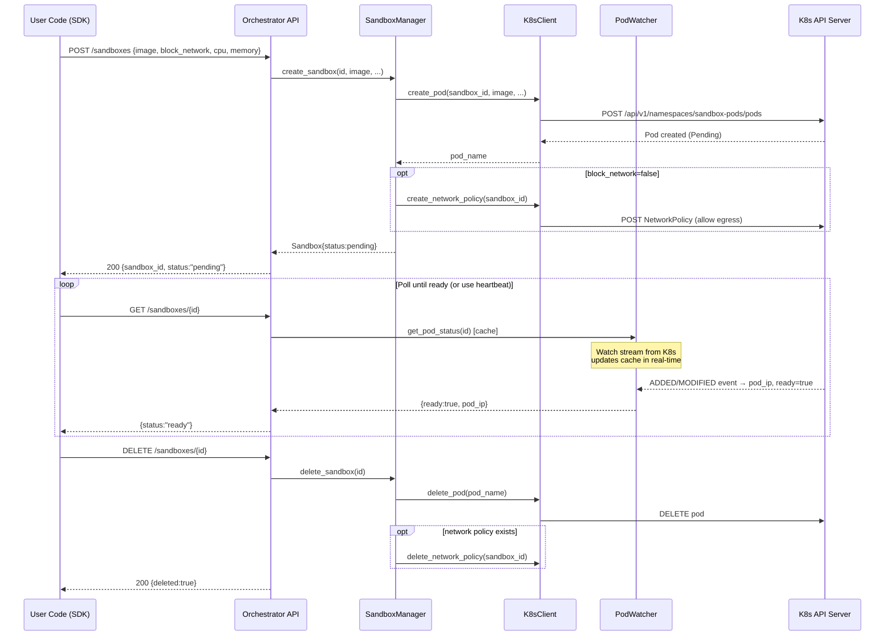
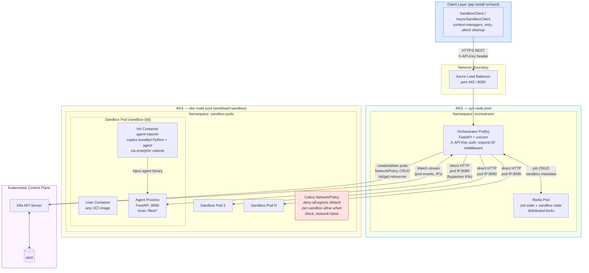
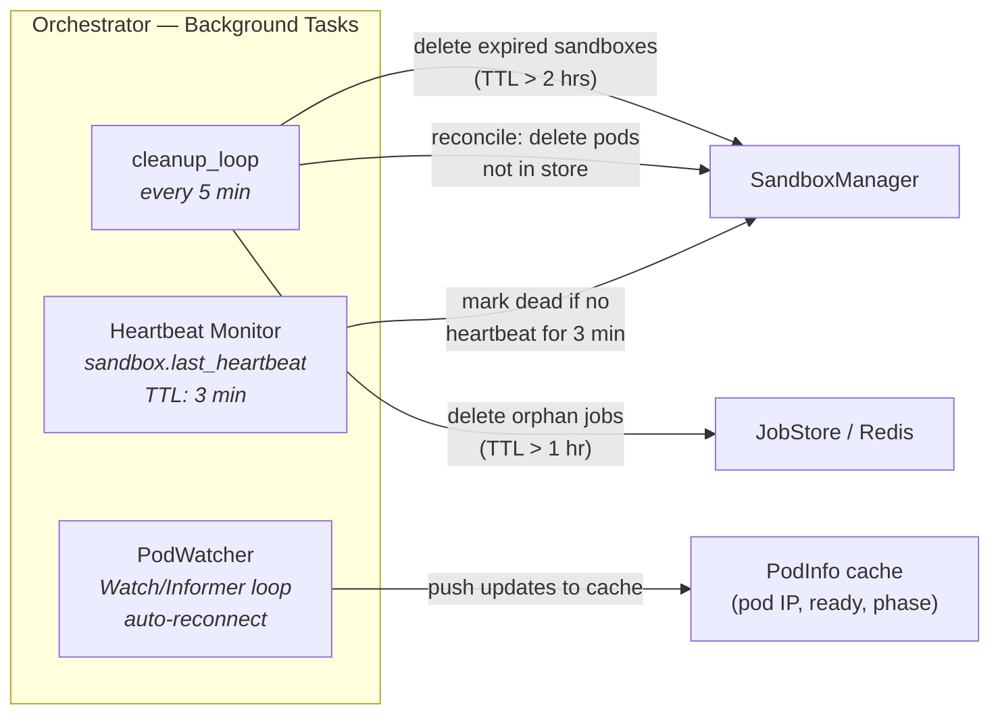
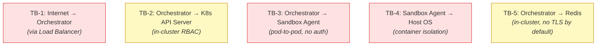
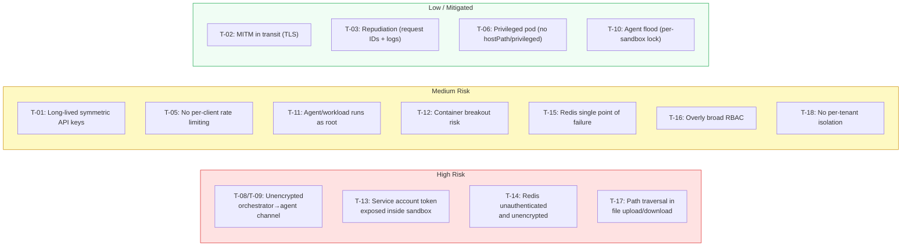

# Orchard: Architecture, Data Flow & Threat Model

> Generated from source-code analysis — May 2026.

---

## Table of Contents

1. [Object Model](#1-object-model)
2. [Exec & File Data Flow](#2-exec--file-data-flow)
3. [Overall Orchestration Architecture](#3-overall-orchestration-architecture)
4. [Threat Model (STRIDE)](#4-threat-model-stride)

---

## 1. Object Model

Key classes and their relationships across all three layers (SDK, Orchestrator, Agent).

---

## 2. Exec & File Data Flow

### 2a. Command Execution (wait=True, completes within server timeout)

### 2b. Command Execution (server-side timeout — client falls back to polling)

### 2c. File Upload / Download Flow

### 2d. Sandbox Lifecycle (Create → Ready → Delete)

---

## 3. Overall Orchestration Architecture

### Background Processes (Orchestrator)

---

## 4. Threat Model (STRIDE)

The STRIDE analysis is applied to the principal trust boundaries and data flows in the system.

> **Status of remediations:** The four high-risk findings (T-08/T-09, T-13,
> T-14, T-17) are currently tracked as open issues in
> [known-issues.md](known-issues.md). They are **not** yet remediated.

### Trust Boundaries

### STRIDE Threat Table

| ID | Boundary | Category | Threat | Current Mitigation | Residual Risk | Recommendation |
|----|----------|----------|--------|--------------------|---------------|----------------|
| T-01 | TB-1 | **Spoofing** | Attacker impersonates legitimate client by stealing or brute-forcing an API key | `X-API-Key` header checked against a set of pre-shared keys in `settings.api_keys` | Medium | Rotate keys regularly; consider short-lived tokens (JWT/OIDC) over long-lived symmetric keys |
| T-02 | TB-1 | **Tampering** | Man-in-the-middle modifies exec command or file content in transit | TLS via Azure Load Balancer (HTTPS) | Low (if TLS enforced) | Enforce HTTPS; reject plain HTTP at load balancer |
| T-03 | TB-1 | **Repudiation** | Caller denies submitting a malicious command | `X-Request-ID` header logged on every request (structured JSON logs → Log Analytics) | Low | Ensure logs are shipped to an immutable store (Azure Log Analytics / Storage immutable policy) |
| T-04 | TB-1 | **Information Disclosure** | Unhandled exception leaks internal details | Global exception handler returns sanitized `{"error":"Internal server error"}` + detail string | Medium | Strip `detail` from 500 responses in production; only log internally |
| T-05 | TB-1 | **Denial of Service** | Flood of sandbox-create requests exhausts node pool | `max_concurrent_creates` semaphore (default 20); K8s scheduler limits | Medium | Add per-client rate limiting at the API gateway; set hard pod quotas in the `sandbox-pods` namespace |
| T-06 | TB-1 | **Elevation of Privilege** | Client passes crafted `image` referencing a privileged image (e.g., host-mount, `--privileged`) | Pod spec is constructed in `sandbox_manager.py` — no `privileged` flag, no `hostPath` volumes | Low | Enforce `PodSecurity` admission policy (`restricted` standard) on the `sandbox-pods` namespace |
| T-07 | TB-3 | **Spoofing** | Rogue pod pretends to be a legitimate sandbox agent; orchestrator connects to wrong pod IP | Orchestrator resolves pod IP from K8s API/PodWatcher (trusted source) | Low-Medium | Consider mutual TLS between orchestrator and agent; validate pod labels before trusting IP |
| T-08 | TB-3 | **Tampering** | Agent HTTP traffic modified in transit between orchestrator and pod (e.g., compromised node) | Pod-to-pod communication is unencrypted HTTP | **High** | Implement mTLS (e.g., Istio/Linkerd service mesh, or self-signed certs in the agent injector) |
| T-09 | TB-3 | **Information Disclosure** | Attacker on the same Kubernetes node intercepts exec stdout/stderr or uploaded file contents | No encryption on the pod-IP channel | **High** | Same as T-08 — enforce mTLS or encrypt at the application layer |
| T-10 | TB-3 | **Denial of Service** | Orchestrator floods a single sandbox agent with concurrent execs | Per-sandbox `asyncio.Lock` serializes exec; `max_concurrent_execs` semaphore bounds total | Low | Already mitigated well |
| T-11 | TB-3 | **Elevation of Privilege** | Agent executes commands as root inside container; malicious command escapes to host | Container isolation (cgroups/namespaces); no `CAP_SYS_ADMIN`; `block_network=True` by default | Medium | Run agent and user code as a non-root user; apply `seccomp` profile (`RuntimeDefault`); use `readOnlyRootFilesystem` where possible |
| T-12 | TB-4 | **Elevation of Privilege** | Container breakout via kernel exploit (e.g., runc CVE) allows access to host or other pods | Sandbox pods on dedicated `sbx` node pool; node-level isolation | Medium | Enable `gVisor`/`kata-containers` runtime class for sandbox pods; keep node OS and runtime patched |
| T-13 | TB-4 | **Information Disclosure** | Sandbox reads secrets from pod environment variables or mounted service-account tokens | Service-account token auto-mount may expose cluster credentials inside sandbox | **High** | Set `automountServiceAccountToken: false` on sandbox pod specs; strip environment variables before exec |
| T-14 | TB-5 | **Tampering** | Attacker who compromises the cluster injects fake job results into Redis | Redis is in-cluster with no TLS or password by default (`redis://redis-service...`) | **High** | Enable Redis AUTH + TLS; use Kubernetes Network Policy to allow only orchestrator pods to reach Redis |
| T-15 | TB-5 | **Denial of Service** | Redis is flooded or crashed, breaking multi-replica job state | Single Redis instance; no HA mentioned in manifests | Medium | Use Redis Sentinel or Redis Cluster; implement graceful fallback to in-memory store on Redis failure |
| T-16 | TB-2 | **Elevation of Privilege** | Compromised orchestrator pod uses its service account to escalate K8s privileges | RBAC manifest (`rbac.yaml`) exists; scope unknown without reviewing exact rules | Medium | Apply least-privilege RBAC: only `get/list/watch/create/delete` on `pods` and `networkpolicies` in `sandbox-pods` namespace |
| T-17 | TB-1 | **Tampering** | Attacker submits a malformed or path-traversal `path` in file upload/download | Path is passed directly to agent which uses `Path(path)` — potential traversal | **High** | Validate that resolved path stays within an allowed root (e.g., `/workspace`); reject `..` segments server-side before forwarding |
| T-18 | TB-1 | **Information Disclosure** | `GET /resources` or `GET /jobs/{id}` returns data belonging to a different tenant | No per-client tenancy isolation; any valid API key can list/exec any sandbox | Medium | Implement per-API-key sandbox ownership; scope `GET /jobs/{id}` to the authenticated key's sandboxes |

---

### Attack Surface Summary

---

### Top Remediation Priorities

| Priority | Threat(s) | Action |
|----------|-----------|--------|
| 🔴 P0 | T-08, T-09 | Enable mTLS between orchestrator and sandbox agents (Istio sidecar or self-signed certs baked into injector) |
| 🔴 P0 | T-13 | Set `automountServiceAccountToken: false` in sandbox pod spec |
| 🔴 P0 | T-14 | Enable Redis `requirepass` + TLS; restrict with NetworkPolicy |
| 🔴 P0 | T-17 | Server-side path validation: reject `..` and enforce `/workspace` root before forwarding to agent |
| 🟠 P1 | T-01 | Replace shared API keys with short-lived OIDC tokens or Azure Managed Identity |
| 🟠 P1 | T-11 | Run containers as non-root (`runAsNonRoot: true`, `runAsUser: 1000`) |
| 🟠 P1 | T-12 | Apply `RuntimeClass: gvisor` to sandbox pod specs |
| 🟠 P1 | T-16 | Audit and tighten RBAC to minimum required verbs and resources |
| 🟡 P2 | T-05 | Add API-gateway rate limiting (e.g., NGINX Ingress `limit_req`) |
| 🟡 P2 | T-18 | Scope sandbox/job access to the creating API key |
