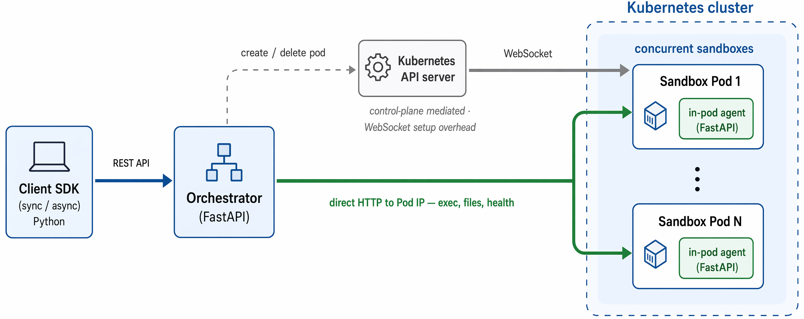

# orchard_env

Kubernetes-based sandbox orchestration for agent environments, plus a Modal-style
Python SDK. Each sandbox is an isolated pod that an agent can drive over many
turns: run commands, upload/download files, apply git patches, open PTY sessions.

- **Fast exec path** — the orchestrator talks HTTP directly to an agent running
  inside each pod, bypassing the Kubernetes API server for exec and file I/O.
- **Any base image** — the in-pod agent is injected by an init container that
  bundles its own self-contained Python interpreter, so images do not need Python.
- **Isolation** — pods run in a dedicated namespace with Calico NetworkPolicies;
  egress can be blocked per sandbox.
- **Scale-out** — multiple orchestrator replicas share state through Redis.
- **Any-harness training** — the popular agent harnesses (`codex`, `claude`, `pi`,
  `opencode`, `hermes`) are preinstalled on `PATH` in every sandbox, so you can
  collect rollouts under whichever harness you train against.
- **Service endpoints** — expose a server running inside a sandbox (an OpenEnv
  environment server, an MCP server, a dev server) at a URL that HTTP and
  WebSocket clients outside the cluster can drive. Opt-in.

<p align="center">
  
</p>

The orchestrator uses the Kubernetes API server only for pod lifecycle (create /
delete). Exec, file I/O, and health checks go straight to each sandbox's Pod IP,
keeping the API server and its WebSocket setup overhead off the hot path — which
is what holds average command latency at 0.28 s across 1,000 concurrent
sandboxes. See [docs/architecture.md](docs/architecture.md) for the full design.

## Installation

```bash
git clone https://github.com/microsoft/Orchard.git
cd Orchard
pip install -e "orchard_env[dev]"
```

## Configuration

The SDK reads configuration from environment variables or constructor arguments.
**Priority:** constructor parameters > environment variables > defaults.

```bash
export SANDBOX_BASE_URL="http://your-orchestrator-host"
export SANDBOX_API_KEY="your-api-key"
export SANDBOX_PREFIX="myapp"          # optional prefix for sandbox IDs
```

Don't have an orchestrator yet? See
[Deploying your own cluster](#deploying-your-own-cluster).

```python
from orchard_env import SandboxClient

client = SandboxClient()                       # from env vars
client = SandboxClient(                        # or explicitly
    base_url="http://your-orchestrator-host",
    api_key="your-api-key",
    prefix="myapp",
)
```

## Usage

### Synchronous client

```python
from orchard_env import SandboxClient

with SandboxClient() as client:
    with client.create_sandbox("python:3.11-slim") as sandbox:
        result = sandbox.exec("echo 'Hello, World!'")
        print(result.stdout)

        result = sandbox.exec(
            "python script.py",
            timeout=60,
            cwd="/workspace",
            env={"DEBUG": "1"},
        )

        sandbox.upload_file("local_file.py", "/workspace/script.py")
        sandbox.download_file("/workspace/output.txt", "local_output.txt")
        sandbox.apply_patch(patch_content)
```

### Talking to a server inside a sandbox

`exec` covers agents that run commands. When the workload is a long-running
server instead — an OpenEnv environment server, an MCP server, a dev server —
expose it and drive it over HTTP or WebSocket:

```python
with SandboxClient() as client:
    with client.create_sandbox("my-env:latest") as sandbox:
        sandbox.exec("nohup python -m http.server 8000 > /tmp/log 2>&1 &")

        endpoint = sandbox.expose_service(8000, wait_ready=True, health_path="/")
        requests.get(f"{endpoint.url}/index.html")   # no API key needed
        sandbox.revoke_service(8000)
```

The URL carries its own credential, so clients that cannot set headers (a raw
WebSocket client, a browser) work unchanged — and appending a path just works,
so a client that adds `/ws` gets a valid URL. Treat the URL as a bearer token:
scope it with `ttl_seconds` and revoke it when done.

Requires `ENABLE_SERVICE_ENDPOINTS=true`, a dedicated
`SERVICE_PUBLIC_BASE_URL`, and `SERVICE_TOKEN_SECRET` on the orchestrator. See
the [API reference](docs/api.md#service-endpoints).

### Asynchronous client

```python
import asyncio

from orchard_env import AsyncSandboxClient


async def main():
    async with AsyncSandboxClient() as client:
        async with await client.create_sandbox("python:3.11-slim") as sandbox:
            result = await sandbox.exec("echo 'Hello, World!'")
            print(result.stdout)

            await sandbox.upload_file("local_file.py", "/workspace/script.py")
            await sandbox.download_file("/workspace/output.txt", "local_output.txt")


asyncio.run(main())
```

Always use the context managers — they guarantee the sandbox is deleted. The
client also cleans up on process exit and on `SIGINT`/`SIGTERM`, and retries
transient failures with exponential backoff. Full method tables, `JobResult`
fields, and creation options are in the [SDK reference](docs/sdk.md).

## Deploying your own cluster

The quickstart above assumes an orchestrator is already running. To stand one up
from scratch, run these four scripts from `orchard_env/`. The full walkthrough —
including every configuration knob, non-Azure clusters, and troubleshooting — is
in the [deployment guide](docs/deployment.md).

### 1. Create the Azure resources

```bash
chmod +x scripts/*.sh
./scripts/deploy_aks.sh          # ~10-15 minutes
```

This creates a resource group, a Log Analytics workspace, an Azure Container
Registry, and an AKS cluster with Calico NetworkPolicy and two node pools:

| Node pool | Purpose |
| --- | --- |
| `sys` | System components and the orchestrator |
| `sbx` | Sandbox pods — labelled `workload=sandbox`, tainted, autoscaled from 0 |

It also fetches cluster credentials and patches `calico-typha` to tolerate the
sandbox taint. Settings are overridable by environment variable, and
`DRY_RUN=true` prints the `az` commands without executing them:

```bash
export RESOURCE_GROUP="my-sandbox-rg"
export LOCATION="westus2"
export CLUSTER_NAME="my-aks"
export ACR_NAME="mysandboxacr$(date +%s)"   # must be globally unique
export SANDBOX_NODE_SIZE="Standard_D8as_v5"
export SANDBOX_NODE_MAX=50
./scripts/deploy_aks.sh
```

The resulting names are written to `.azure-config` (git-ignored), which the next
two scripts source automatically.

### 2. Build and push the images

```bash
./scripts/build_push.sh          # orchestrator, sandbox, agent-injector, tools
```

### 3. Deploy to Kubernetes

```bash
./scripts/deploy_k8s.sh
```

This applies the namespaces, RBAC, ConfigMap, API-key Secret, Redis, the
orchestrator Deployment, a ClusterIP Service, and a **LoadBalancer Service** —
then waits for the cloud provider to assign an external IP and prints it:

```
Access the service:
  External (LoadBalancer): http://20.x.x.x
    export SANDBOX_BASE_URL=http://20.x.x.x
```

Skip the LoadBalancer with `CREATE_LOADBALANCER=false` (for example when you
front the service with an Ingress instead), or adjust how long the script waits
for the IP with `LB_WAIT_SECONDS=300`.

> Generate your own API keys before exposing the service:
>
> ```bash
> python k8s/gen_keys.py
> cp k8s/secret.example.yaml k8s/secret.yaml   # then paste the keys in
> ```
>
> `k8s/secret.yaml` is gitignored — only the `.example` template is tracked, so
> real keys never get committed.

### 4. Verify

```bash
export SANDBOX_BASE_URL="http://<external-ip>"
export SANDBOX_API_KEY="<one-of-your-keys>"
./scripts/smoke_test.sh
```

## Built-in agent harnesses

Every sandbox ships with five popular agent harnesses already on `PATH` — no
install step and no network access needed inside the sandbox. Training or
evaluating against a different harness is a change of command, not a change of
image.

| Command | Harness |
| --- | --- |
| `codex` | OpenAI Codex CLI |
| `claude` | Anthropic Claude Code |
| `pi` | [earendil-works/pi](https://github.com/earendil-works/pi) |
| `opencode` | [OpenCode](https://opencode.ai) |
| `hermes` | [Nous Research Hermes](https://github.com/nousresearch/hermes-agent) |

```python
with client.create_sandbox(image="ubuntu:22.04") as sandbox:
    # Credentials are supplied per call — nothing is baked into the image
    result = sandbox.exec(
        "codex exec 'summarize this repo'",
        env={"OPENAI_API_KEY": "sk-..."},
        timeout=600,
    )
    result = sandbox.exec(
        "claude -p 'fix the failing test'",
        env={"ANTHROPIC_API_KEY": "sk-ant-..."},
        timeout=600,
    )
```

Notes:

- Works with **any** base image: every harness is verified on glibc 2.17 → 2.39
  (CentOS 7 through Ubuntu 24.04), including SWE-bench images. No Node.js or
  Python is required in the image — each payload is self-contained and relocatable.
- Reachable from every entry point: `sandbox.exec()`, `exec(..., login_shell=True)`,
  and `kubectl exec -it sandbox-<id> -n sandbox-pods -- bash`.
- The harnesses never shadow a tool your image already provides and are **appended**
  to `PATH`, so an existing toolchain (e.g. SWE-bench's `/opt/miniconda3/bin`) keeps
  priority. `hermes` runs under its own bundled interpreter and never touches the
  image's `python`.
- The payload is mounted **read-only** at `/opt/sandbox-tools`;
  `cat /opt/sandbox-tools/VERSIONS` shows the exact versions baked in.
- `block_network=True` sandboxes can still run the harnesses, but the harnesses
  themselves need egress to reach model APIs — use `block_network=False` for real
  usage.

Copilot CLI, Cursor Agent and Gemini CLI are **not** bundled: their payloads
require `GLIBC_2.28`, so supporting the full image range would mean shipping a
patched private glibc for them.

### How it works

The harnesses live in a dedicated `sandbox-tools` image that is mounted straight
into each pod via a Kubernetes
[`image` volume source](https://kubernetes.io/docs/concepts/storage/volumes/#image),
so the kubelet pulls it **once per node** and there is no per-pod copy.

```bash
./scripts/build_push.sh tools

# or pin exact harness versions
CODEX_VERSION=0.145.0 CLAUDE_CODE_VERSION=2.1.220 OPENCODE_VERSION=1.18.7 \
  PI_VERSION=v0.82.1 HERMES_VERSION=0.19.0 ./scripts/build_push.sh tools
```

Relevant orchestrator settings (see `k8s/configmap.yaml`):

| Setting | Default | Description |
| --- | --- | --- |
| `ENABLE_SANDBOX_TOOLS` | `true` | Set to `false` to omit the harnesses entirely |
| `SANDBOX_TOOLS_IMAGE` | `sandbox-tools:latest` | Image holding the harness payload |
| `SANDBOX_TOOLS_MOUNT_PATH` | `/opt/sandbox-tools` | Where the payload is mounted |
| `SANDBOX_TOOLS_VOLUME_MODE` | `image` | `image` (needs k8s ≥ 1.33 + containerd ≥ 2.0) or `initcontainer` |

On clusters older than k8s 1.33, switch `SANDBOX_TOOLS_VOLUME_MODE` to
`initcontainer`. That mode copies the payload into a per-pod `emptyDir` instead,
which costs roughly 1.1 GB of ephemeral disk per sandbox — prefer `image` mode
wherever it is available.

> **Updating harness versions:** the payload is pulled with `IfNotPresent`, so
> nodes that already cached `sandbox-tools:latest` keep serving the old copy. Push
> a new tag (e.g. `TOOLS_TAG=2026-07-27 ./scripts/build_push.sh tools`) and point
> `SANDBOX_TOOLS_IMAGE` at it so every node picks up the change.

## Sandbox service endpoints

Off by default. Enable them when something inside the sandbox listens on a port
and a client outside the cluster needs to talk to it.

| Setting | Default | Description |
| --- | --- | --- |
| `ENABLE_SERVICE_ENDPOINTS` | `false` | Master switch |
| `SERVICE_PUBLIC_BASE_URL` | — | Wildcard template, e.g. `https://{subdomain}.sandboxes.example.net` |
| `SERVICE_ALLOW_INSECURE_HTTP` | `false` | Development-only HTTP escape hatch |
| `SERVICE_TOKEN_SECRET` | — | Required HMAC key for service URLs |
| `SERVICE_TOKEN_TTL_SECONDS` | `3600` | Lifetime of a service URL |
| `SERVICE_RESERVED_PORTS` | — | Extra ports that may never be exposed |
| `MAX_SERVICES_PER_SANDBOX` | `8` | Ports one sandbox may expose at once |
| `SERVICE_TRAFFIC_REFRESHES_HEARTBEAT` | `true` | Proxied traffic keeps the sandbox alive |
| `SERVICE_PROXY_MAX_REQUEST_BYTES` | `16777216` | Maximum proxied request body |

A service URL is a **bearer credential**: whoever holds it can reach that port
on that sandbox until it expires. `SERVICE_PUBLIC_BASE_URL` must be a wildcard
HTTPS template on a separate registrable domain from the management API.
Orchard gives every capability a different hostname, which is the browser
security boundary between hostile sandbox services. Configure wildcard DNS and
TLS, redact `/s/*` in ingress logs, keep URLs out of traces and referrers, and
revoke them when finished. The in-pod agent port is never exposable.

## Development

```bash
pip install -e "orchard_env[dev]"

# run the orchestrator locally against your kubeconfig
export IN_CLUSTER=false
python -m orchard_env.orchestrator.main

# lint and format
ruff check .
black --check .

# unit tests — offline, no orchestrator required
python -m pytest

# integration scripts — require a live orchestrator
export SANDBOX_BASE_URL="http://your-orchestrator-host"
export SANDBOX_API_KEY="your-api-key"
python tests/integration/soak.py
python tests/integration/sandbox_tools.py
python tests/integration/service_endpoint.py
```

See [tests/README.md](tests/README.md) for what each one covers.

## More documentation

- [SDK reference](docs/sdk.md) — clients, methods, `JobResult`, retries
- [Deployment guide](docs/deployment.md) — cluster setup, configuration, operations
- [Architecture](docs/architecture.md)
- [HTTP API reference](docs/api.md)
- [Tests](tests/README.md) · [Examples](examples/README.md)

## Contributing and security

Contributions follow the Orchard [Code of Conduct](../CODE_OF_CONDUCT.md).
Report security vulnerabilities privately as described in
[SECURITY.md](../SECURITY.md) — never through a public GitHub issue.

## License

[MIT](LICENSE) © Microsoft Corporation.
